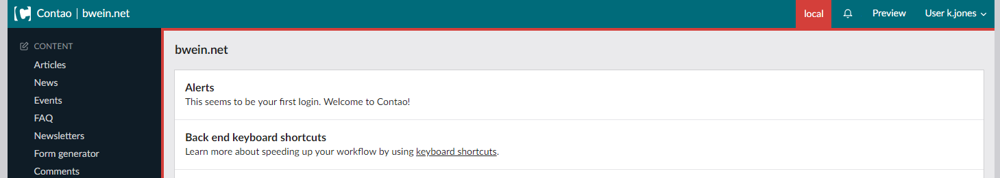
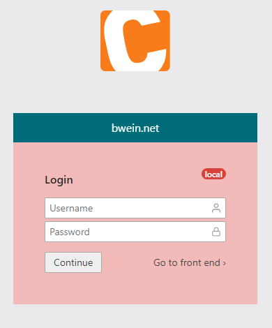

# Backend Customizer for Contao Open Source CMS

With this bundle, some parameters can be set via config, whereby the back end theme of Contao will be individually styled using CSS variables and Javascript.

## Installation

Install the bundle via Composer:

```
composer require bwein-net/contao-backend-customizer
```

Add the config parameters and clear the cache.

## Configuration

In the ``config/config.yml`` you can add the following parameters - all parameters are empty by default:

```yaml
# config/config.yml
bwein_backend_customizer:
    header_title: 'bwein.net'
    header_color: '#006B7A'
    header_invert: false
```

The ``header_title`` is shown on the left side of the back end header next to the contao logo and on the back end login form.
With the ``header_color`` you can override the typical contao color of the back end header.
The option ``header_invert`` inverts the color of all header elements, if you set it to `true`.

Ideally in the ``config/parameters.yml`` you can set the environment parameters, so that it can differentiate between the deployed webspaces.

```yml
# config/parameters.yml
bwein_backend_customizer:
    env_title: 'local'
    env_color: ~
    main_color: ~
```

The ``env_title`` is shown as badge on the back end header and login form.

You can set the following ``env_title`` values - and then the environment badge will be shown in the color in brackets:
 * ``'local'`` (red)
 * ``'dev'`` (orange)
 * ``'staging'`` (green)
 * ``'prod'`` (none - same as default `~`)

To override the default color for the environment badge and main container, you can set the param ``env_color`` and ``main_color`` with color values.
Besides, if you use a different ``env_title``, the ``env_color`` is mandatory to show the environment badge!

> After manipulating the configuration you first have to **clear the application cache** to adopt new parameters to the back end.

## Screenshots




